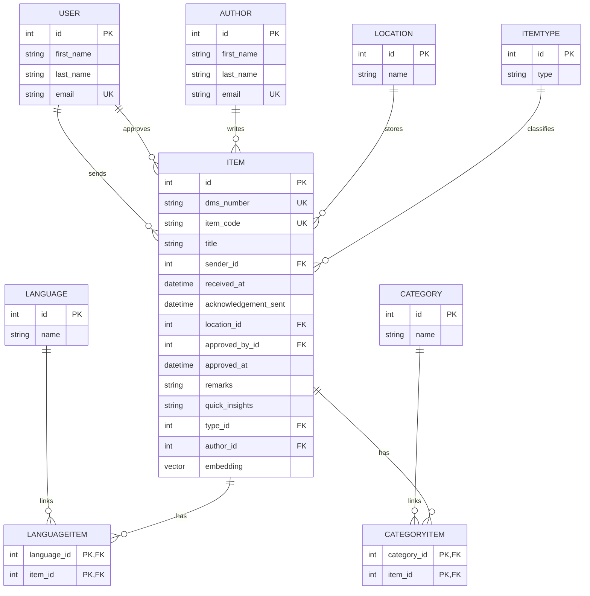

```mermaid
erDiagram
	USER ||--o{ ITEM : sends
	USER ||--o{ ITEM : approves
	AUTHOR ||--o{ ITEM : writes
	LOCATION ||--o{ ITEM : stores
	ITEMTYPE ||--o{ ITEM : classifies

	LANGUAGE ||--o{ LANGUAGEITEM : links
	ITEM ||--o{ LANGUAGEITEM : has

	CATEGORY ||--o{ CATEGORYITEM : links
	ITEM ||--o{ CATEGORYITEM : has

	USER {
		int id PK
		string first_name
		string last_name
		string email UK
	}

	AUTHOR {
		int id PK
		string first_name
		string last_name
		string email UK
	}

	ITEMTYPE {
		int id PK
		string type
	}

	LOCATION {
		int id PK
		string name
	}

	LANGUAGE {
		int id PK
		string name
	}

	CATEGORY {
		int id PK
		string name
	}

	ITEM {
		int id PK
		string dms_number UK
		string item_code UK
		string title
		int sender_id FK
		datetime received_at
		datetime acknowledgement_sent
		int location_id FK
		int approved_by_id FK
		datetime approved_at
		string remarks
		string quick_insights
		int type_id FK
		int author_id FK
		vector embedding
	}

	LANGUAGEITEM {
		int language_id PK, FK
		int item_id PK, FK
	}

	CATEGORYITEM {
		int category_id PK, FK
		int item_id PK, FK
	}
```